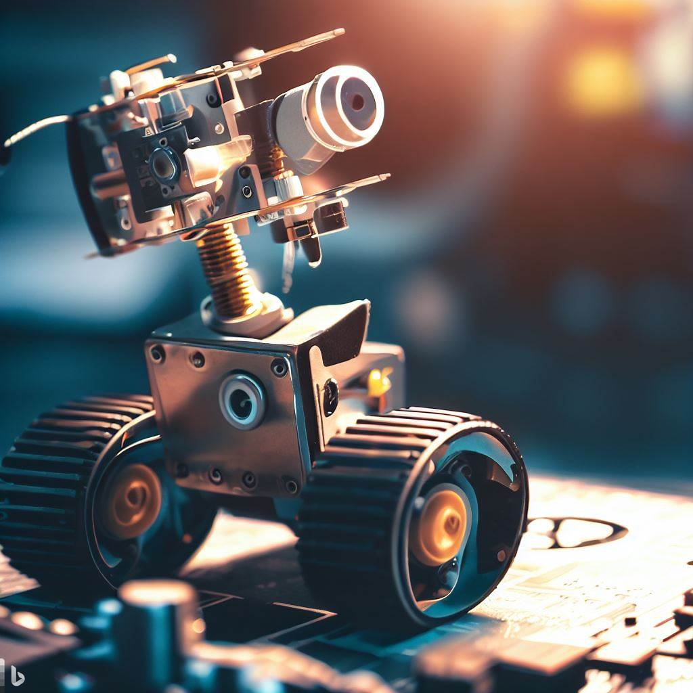

# Robotics Fundamentals

    
    

This repository contains personal code and notes focusing on robotics fundamental using various resources. I don't own any of the material, I just want to share my personal notes and code while I learn about robotics fundamentals.
## Overview of the repository
### foundation of robotics motions
- [ ] Degrees of freedom of a rigid body
- [ ] Degrees of freedom of a robot
- [ ] Configuration space Topology
- [ ] Configuration and Velocity Constraints
- [ ] Taskspace and Workspace

### introduction to rigid body motions
- [ ] Rotation matrices
- [ ] Angular velocity
- [ ] Exponential coordinates
- [ ] Homogeneous transformations
- [ ] Twists
- [ ] Wrenches

### forward kinematics of open chains robots
- [ ] Zero configuration
- [ ] Configuration of end-effectors
- [ ] Product of exponentials formula

### velocity kinematics and statics
- [ ] Jacobian matrix
- [ ] Manipulability ellipsoid
- [ ] Body and space jacobians
- [ ] Statics of open chains
- [ ] Singularity
- [ ] Manipularity

### Inverse kinematic of open chains robots
- [ ] Numerical solutions
- [ ] Newton-Raphson Method
- [ ] Minimal coordinates and matrices

### Kinematic of closed chains robots
- [ ] Forward kinematics
- [ ] Velocity kinematics
- [ ] Inverse kinematics
- [ ] Singularity

### Dynamics of open chains robots
- [ ] Lagrangian dynamics
- [ ] Newton-Euler equation
- [ ] Motion equations
- [ ] Inertia matrix
- [ ] Constrains
- [ ] Actuation and Gearing

### Bayesian estimation
- [ ] Probability
- [ ] Bayes' rule
- [ ] Gaussian distribution
- [ ] Kalman filter
- [ ] Extended Kalman filter
- [ ] Unscented Kalman filter
- [ ] MAP, MMSE, and MLE

## Resources
- [Modern Robotics: Mechanics, Planning, and Control" by Kevin M. Lynch and Frank C. Park](http://hades.mech.northwestern.edu/index.php/Modern_Robotics)
- [Kilman Filter](http://www.kalmanfilter.net)
- [Statistics IB](http://www.statslab.cam.ac.uk/Dept/People/djsteaching/S1B-17-01-intro-prob-4.pdf)

